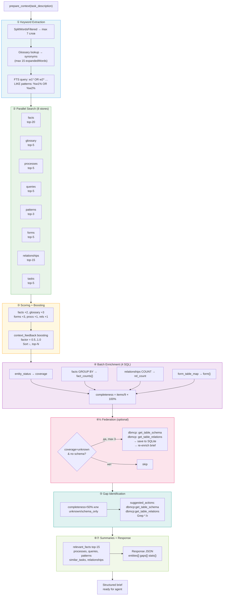
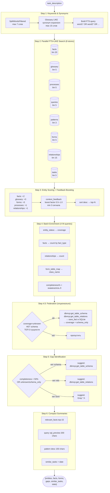

# ProjectMemory — Workflow Guide

## Обзор

ProjectMemory — MCP-сервер для накопления знаний о проекте MERP между сессиями Claude Code.
40 инструментов разделены на 3 уровня: базовые (CRUD), аналитические, контекстные.

**Исходники**: `C:\RADProjects\MCPHub\src\servers\projectMemory\`
**Build**: RAD Studio 37.0, `MCPHub.cbproj` (конфигурация Release, платформа Win64x)
**Deploy**: MCPHub.exe, порт 8766
**БД**: `C:\Monarch\MERP_DATA\ProjectMemory\project_memory.db` (SQLite + FTS5)

---

## Архитектура: 3 слоя

```
┌──────────────────────────────────────────────────────┐
│  Layer 3: Claude Code Agent (pm-context)             │
│  - Получает structured brief от PM                   │
│  - Заполняет code gaps (Grep/Read)                   │
│  - Auto-save обратно в PM (bulk_save)                │
│  - ~10 вызовов вместо 20                             │
└────────────────┬─────────────────────────────────────┘
                 │ 1 вызов prepare_context(task)
┌────────────────▼─────────────────────────────────────┐
│  Layer 2: ProjectMemory (server-side intelligence)   │
│  - Batch FTS по всем 7 stores (один вход)            │
│  - Gap identification + suggested actions            │
│  - Feedback boosting                                 │
│  - [Planned] Federation -> dbmcp HTTP                │
│  - [Planned] Embedding search                        │
└────────────────┬─────────────────────────────────────┘
                 │ HTTP localhost:8766
┌────────────────▼─────────────────────────────────────┐
│  Layer 1: dbmcp (live database, always fresh)        │
│  - port 8765                                         │
└──────────────────────────────────────────────────────┘
```

---

## Новый workflow: prepare_context

### Было (старый подход, 5+ вызовов)

```
get_facts("MoveMaterials")              → 7700 chars
get_relationships("MoveMaterials")      → 2500 chars
find_form(table="MoveMaterials")        → 600 chars
get_glossary(term="Перемещение")        → 1500 chars
get_entity_status("MoveMaterials")      → 1000 chars
─────────────────────────────────────────────────────
ИТОГО: 5 вызовов, ~13400 chars, только 1 сущность
```

Для 3 сущностей: 15 вызовов. Для задачи с неизвестными сущностями: сначала ask_business + анализ, потом 15+ вызовов.

### Стало (новый подход)

**Вариант A — знаешь сущности:**
```
batch_context(entities=["MoveMaterials","Storage","Nomenclatura"])
→ 1 вызов, все facts/rels/forms/glossary/status для 3 сущностей
```

**Вариант B — знаешь задачу, не знаешь сущности:**
```
prepare_context(task_description="исправить ошибку при перемещении материалов")
→ 1 вызов:
  - извлекает ключевые слова
  - расширяет синонимами из glossary
  - ищет по ВСЕМ 7 хранилищам (FTS + LIKE)
  - ранжирует сущности по релевантности
  - обогащает top-N фактами/связями/формами
  - определяет gaps с suggested actions
  - возвращает structured brief
```

**Вариант C — оценка качества базы знаний:**
```
quality_report()
→ global: entities=188, facts=441, relationships=204, coverage distribution
→ per-entity: quality_report(entity="MoveMaterials") → completeness=100%

identify_gaps(entities=["Storage","Product"])
→ Storage: completeness=44%, missing=[business_rule, form_mapping], suggested: Grep CStorageDlg
→ Product: completeness=77%, missing=[gotcha, statistics]
```

---

## Детальная архитектура prepare_context

### Параметры

| Параметр | Тип | Обязателен | Описание |
|----------|-----|-----------|---------|
| `task_description` | string | ✅ | Описание задачи на любом языке (RU/EN) |
| `max_entities` | int | — | Максимум сущностей в ответе (1–30, default 10) |
| `include_code_search` | bool | — | Включить Grep-actions в `gaps` (default true) |

---

### Схема выполнения (7 шагов)

```
prepare_context("исправить ошибку при перемещении материалов")
       │
       ▼
┌─────────────────────────────────────────────────────────────────────┐
│  ШАГ 1 — Keyword extraction + Synonym expansion                     │
│                                                                     │
│  SplitWordsFiltered(task) → ["исправить","ошибку","перемещение",   │
│                               "материалов"]  (max 7 слов)          │
│       │                                                             │
│       ▼                                                             │
│  Для каждого слова → SELECT synonyms FROM glossary WHERE term LIKE  │
│  → добавить синонимы в expandedWords (max 15 итого)                │
│  → expandedWords = ["перемещение","MoveMaterials","move","склад"…]  │
│       │                                                             │
│  Build FTS query:  "перемещен* OR MoveMaterial* OR move* OR …"     │
│  Build LIKE patterns: f.entity LIKE '%перемещение%' OR …           │
└──────────────────────────────┬──────────────────────────────────────┘
                               │
                               ▼
┌─────────────────────────────────────────────────────────────────────┐
│  ШАГ 2 — Parallel FTS+LIKE search по 8 хранилищам                  │
│                                                                     │
│  facts          (FTS5 → LIKE, top 20)   → entity, fact_type, desc  │
│  glossary       (FTS5 → LIKE, top  5)   → term, entity, synonyms   │
│  business_processes (FTS5 → LIKE, top 5) → name, related_entities  │
│  verified_queries   (FTS5 → LIKE, top 5) → purpose, sql_text       │
│  code_patterns  (FTS5 → LIKE, top  3)   → pattern_name, desc       │
│  form_table_map (LIKE only,     top  5)  → template, class, table  │
│  relationships  (LIKE only,     top 15)  → from, to, rel_type      │
│  completed_tasks(FTS5 → LIKE,   top  5)  → title, date             │
│                                                                     │
│  RankedSearch = FTS5 (bm25 rank) + LIKE fallback, дедупликация     │
└──────────────────────────────┬──────────────────────────────────────┘
                               │
                               ▼
┌─────────────────────────────────────────────────────────────────────┐
│  ШАГ 3 — Entity scoring + Feedback boosting                         │
│                                                                     │
│  Извлечь entity из каждого результата + начислить очки:             │
│    facts:         +2 per match   (высокая частота)                  │
│    glossary:      +3 per match   (прямое терминологическое попадание)│
│    forms:         +3 per match   (прямая форма ↔ таблица)           │
│    processes:     +1 per related entity                             │
│    relationships: +1 per from/to entity                             │
│                                                                     │
│  Feedback boosting (если ≥3 записей в context_feedback):            │
│    factor = 0.5 + 0.5 × (pos_signals / total_signals)              │
│    → useful entity: factor ≈ 1.0  (score сохраняется)              │
│    → useless entity: factor ≈ 0.5 (score вдвое меньше)             │
│    score = round(score × factor), min 1                             │
│                                                                     │
│  Сортировка ↓ по score → top maxEnt сущностей                       │
└──────────────────────────────┬──────────────────────────────────────┘
                               │
                               ▼
┌─────────────────────────────────────────────────────────────────────┐
│  ШАГ 4 — Batch enrichment (4 SQL запроса для всех топ-N сразу)      │
│                                                                     │
│  SELECT entity, coverage FROM entity_status WHERE entity IN (...)   │
│  SELECT entity, fact_type, COUNT(*) FROM facts … GROUP BY …         │
│  SELECT entity_from/to, COUNT(*) FROM relationships … UNION ALL …  │
│  SELECT template, class_name, file_path FROM form_table_map …       │
│                                                                     │
│  Собрать brief для каждой сущности:                                 │
│    { name, relevance, coverage, fact_counts{}, total_facts,         │
│      rel_count, form{class_name, file_path}, completeness% }        │
│                                                                     │
│  completeness = 100 × (кол-во присутствующих типов данных) / 9      │
└──────────────────────────────┬──────────────────────────────────────┘
                               │
                               ▼
┌─────────────────────────────────────────────────────────────────────┐
│  ШАГ 4.5 — Federation (auto-fetch из dbmcp, если клиент доступен)   │
│                                                                     │
│  Для top-3 сущностей с coverage=unknown И нет схемы:               │
│    FederateEntity(entity) →                                          │
│      dbmcp: get_table_schema(entity)  → save_fact(schema)           │
│      dbmcp: get_table_relations(entity) → save_relationship(…)      │
│    Пересчитать brief из SQLite после сохранения                     │
│    coverage → schema_only, +2 dbmcp_calls в stats                   │
│                                                                     │
│  federation_log: [{entity, status:"fetched"}]                        │
└──────────────────────────────┬──────────────────────────────────────┘
                               │
                               ▼
┌─────────────────────────────────────────────────────────────────────┐
│  ШАГ 5 — Gap identification                                          │
│                                                                     │
│  Для сущностей с completeness < 50% или coverage=unknown/schema_only:│
│    нет схемы  → suggested: dbmcp:get_table_schema(entity)           │
│    нет FK     → suggested: dbmcp:get_table_relations(entity)        │
│    нет формы  → suggested: Grep(pattern=entity, glob="*.h")         │
│                                                                     │
│  gaps: [{entity, coverage, completeness, suggested_actions[]}]       │
└──────────────────────────────┬──────────────────────────────────────┘
                               │
                               ▼
┌─────────────────────────────────────────────────────────────────────┐
│  ШАГ 6+7 — Compact summaries + Response assembly                    │
│                                                                     │
│  relevant_facts  top-15 (entity, type, description, confidence)     │
│  processes       id + name                                           │
│  queries         id + purpose + sql_preview (truncate 200 chars)    │
│  patterns        name + description (truncate 150 chars)            │
│  similar_tasks   id + title + date                                  │
│  relationships   from + to + type                                   │
│                                                                     │
│  Response JSON:                                                      │
│  { task_summary, keywords[], entities[], relevant_facts[],          │
│    relationships[], forms[], processes[], queries[], patterns[],    │
│    similar_tasks[], gaps[], federation_log?, stats{} }              │
└─────────────────────────────────────────────────────────────────────┘
```

---

### Mermaid: поток данных



---

### Структура ответа

```json
{
  "task_summary": "исправить ошибку при перемещении материалов",
  "keywords": ["перемещение", "материал", "ошибка"],
  "entities": [
    {
      "name": "MoveMaterials",
      "relevance": 11,
      "coverage": "full",
      "total_facts": 12,
      "fact_counts": { "schema": 2, "business_rule": 5, "gotcha": 3, "code_pattern": 2 },
      "rel_count": 8,
      "form": { "class_name": "CMERP_ViewFormMoveMaterial", "file_path": "MERP_ViewFormMoveMaterial.h" },
      "completeness": 88
    }
  ],
  "relevant_facts": [
    { "id": 42, "entity": "MoveMaterials", "type": "gotcha", "description": "...", "confidence": "verified" }
  ],
  "relationships": [
    { "from": "MoveMaterials", "to": "Storage", "type": "references" }
  ],
  "forms":    [{ "template": "...", "class_name": "...", "main_table": "MoveMaterials" }],
  "processes": [{ "id": 7, "name": "Lifecycle перемещения материалов" }],
  "queries":  [{ "id": 3, "purpose": "Список перемещений", "sql_preview": "SELECT TOP 100..." }],
  "patterns": [{ "name": "DataSet CRUD", "description": "..." }],
  "similar_tasks": [{ "id": 12, "title": "Баг в форме перемещений", "date": "2026-02-15" }],
  "gaps": [
    {
      "entity": "Storage",
      "coverage": "unknown",
      "completeness": 11,
      "suggested_actions": [
        { "tool": "dbmcp:get_table_schema", "params": { "table": "Storage" }, "reason": "Schema not in PM" },
        { "tool": "Grep",                  "params": { "pattern": "Storage", "glob": "*.h" }, "reason": "Find form/dialog class" }
      ]
    }
  ],
  "federation_log": [{ "entity": "Storage", "status": "fetched" }],
  "stats": {
    "pm_queries": 12,
    "dbmcp_calls": 2,
    "entities_found": 5,
    "gaps_found": 1,
    "keywords_used": 4,
    "synonyms_expanded": 3
  }
}
```

---

### Скоринг сущностей (Шаг 3)

| Источник | Очки | Логика |
|----------|------|--------|
| `facts` | +2 | За каждый матч `entity` в facts |
| `glossary` | +3 | Прямое терминологическое попадание |
| `forms` | +3 | Прямая форма ↔ main_table |
| `processes` | +1 | За каждую сущность в `related_entities[]` |
| `relationships` | +1 | За `entity_from` и `entity_to` |
| **Feedback boost** | ×0.5–1.0 | `factor = 0.5 + 0.5 × (pos/total)`, только если ≥3 feedbacks |

**Пример**: MoveMaterials нашлась в 3 facts (+6) + glossary (+3) + 1 form (+3) + 2 rels (+2) = **14 очков** → #1.

---

### Когда использовать

| Ситуация | Инструмент | Причина |
|----------|-----------|---------|
| Начало любой coding-задачи | `prepare_context` | 1 вызов = полный контекст |
| Знаешь точные entity-имена | `batch_context` | Чуть быстрее (нет NLP шага) |
| Только чтение/поиск | `ask_business` | Проще, нет gaps/federation |
| Нужна свежая схема БД | `dbmcp:get_table_schema` | PM может быть устаревшим |
| После задачи (обратная связь) | `context_feedback` | Улучшает будущий скоринг |

---

## Детальное описание: prepare_context

### Назначение

`prepare_context(task_description)` — единственный вызов, который заменяет весь pre-task workflow. Принимает описание задачи на естественном языке (русском или английском), ищет по всем 7 хранилищам PM, ранжирует сущности, обогащает их контекстом и возвращает структурированный brief, готовый к употреблению агентом без дополнительных запросов.

### Параметры

| Параметр | Тип | Обязателен | Описание |
|----------|-----|-----------|----------|
| `task_description` | string | **да** | Описание задачи — любое предложение, вопрос или набор ключевых слов |
| `max_entities` | integer | нет | Максимум сущностей в ответе (default 10, max 30) |
| `include_code_search` | boolean | нет | Включать Grep в suggested_actions (default true) |

### Алгоритм (7 шагов)

```
┌─────────────────────────────────────────────────────────────────────────────┐
│  ВХОД: task_description = "исправить валидацию при перемещении материалов"  │
└──────────────────────────┬──────────────────────────────────────────────────┘
                           │
              ┌────────────▼────────────┐
              │  STEP 1: Keywords       │
              │  SplitWordsFiltered()   │
              │  → ["перемещени",       │  stop-words отфильтрованы
              │     "материал",         │  макс. 7 слов
              │     "валидаци"]         │
              │                         │
              │  + synonym expansion    │  LIKE-запрос в glossary
              │  → ["MoveMaterials",    │  до 15 слов итого
              │     "материалы",        │
              │     "MoveMaterial"]     │
              └────────────┬────────────┘
                           │  ftsQuery = "перемещени* OR материал* OR ..."
              ┌────────────▼────────────────────────────────────────────────┐
              │  STEP 2: Parallel FTS+LIKE поиск по 8 хранилищам           │
              │                                                             │
              │  ┌─────────┐  ┌──────────┐  ┌──────────┐  ┌───────────┐  │
              │  │  facts  │  │ glossary │  │processes │  │  queries  │  │
              │  │ lim: 20 │  │  lim: 5  │  │  lim: 5  │  │  lim: 5   │  │
              │  └─────────┘  └──────────┘  └──────────┘  └───────────┘  │
              │  ┌─────────┐  ┌──────────┐  ┌──────────┐  ┌───────────┐  │
              │  │patterns │  │  forms   │  │   rels   │  │   tasks   │  │
              │  │  lim: 3 │  │  lim: 5  │  │ lim: 15  │  │  lim: 5   │  │
              │  └─────────┘  └──────────┘  └──────────┘  └───────────┘  │
              │                                                             │
              │  Каждое хранилище: FTS5 MATCH → если 0 результатов →      │
              │                     LIKE fallback                           │
              └────────────┬────────────────────────────────────────────────┘
                           │  raw matches из всех 8 хранилищ
              ┌────────────▼────────────┐
              │  STEP 3: Entity scoring │
              │                         │
              │  facts match:    +2 ea  │
              │  glossary match: +3 ea  │  (высокая ценность)
              │  forms match:    +3 ea  │  (высокая ценность)
              │  process rel:    +1 ea  │
              │  rels match:     +1 ea  │
              │                         │
              │  + Feedback boosting    │  (min 3 сигнала в context_feedback)
              │  factor = 0.5 +         │  полезная → ×1.0
              │    0.5 × pos/(pos+neg)  │  бесполезная → ×0.5
              │                         │
              │  → sort desc, top-N    │
              └────────────┬────────────┘
                           │  ranked entities: [("MoveMaterials",8), ("Storage",3), ...]
              ┌────────────▼────────────────────────────────────────────────┐
              │  STEP 4: Batch enrichment (4 IN-запроса на все top-N)       │
              │                                                             │
              │  SELECT coverage FROM entity_status WHERE entity IN (...)  │
              │  SELECT fact_type, COUNT FROM facts WHERE entity IN (...)   │
              │  SELECT COUNT FROM relationships WHERE entity IN (...)      │
              │  SELECT class_name, file_path FROM form_table_map WHERE ... │
              │                                                             │
              │  → completeness% = (fact_types + has_rels + has_form) / 9  │
              └────────────┬────────────────────────────────────────────────┘
                           │
              ┌────────────▼────────────────────────────────────────────────┐
              │  STEP 4.5: Federation (если dbmcp доступен)                 │
              │                                                             │
              │  Для топ-3 сущностей с coverage=unknown и нет schema:       │
              │    FederateEntity(entity) →                                 │
              │      dbmcp:get_table_schema  → save_fact(schema)           │
              │      dbmcp:get_table_relations → save_fact(relationship)   │
              │    → coverage меняется на schema_only                       │
              │    → re-enrich brief из SQLite                              │
              └────────────┬────────────────────────────────────────────────┘
                           │
              ┌────────────▼────────────┐
              │  STEP 5: Gap detection  │
              │                         │
              │  Для каждой сущности    │
              │  completeness < 50%     │
              │  OR unknown/schema_only:│
              │                         │
              │  нет schema →           │
              │    suggest dbmcp:       │
              │    get_table_schema     │
              │                         │
              │  нет rels →             │
              │    suggest dbmcp:       │
              │    get_table_relations  │
              │                         │
              │  нет form →             │
              │    suggest Grep *.h     │
              └────────────┬────────────┘
                           │
              ┌────────────▼────────────┐
              │  STEP 6: Summaries      │
              │                         │
              │  relevant_facts: top 15 │  entity, type, description
              │  processes: id + name   │
              │  queries: + sql preview │  обрезается до 200 символов
              │  patterns: + desc 150   │
              │  similar_tasks: + date  │
              │  relationship pairs     │  from → to, type
              └────────────┬────────────┘
                           │
              ┌────────────▼────────────────────────────────────────────────┐
              │  STEP 7: Response                                           │
              │                                                             │
              │  {                                                          │
              │    task_summary, keywords,                                  │
              │    entities[]:  name, relevance, coverage,                  │
              │                 fact_counts{}, total_facts,                 │
              │                 rel_count, form{}, completeness%            │
              │    relevant_facts[], relationships[], forms[],              │
              │    processes[], queries[], patterns[], similar_tasks[],     │
              │    gaps[]: entity, coverage, completeness, suggested_actions│
              │    federation_log[],  (если было)                          │
              │    stats: pm_queries, dbmcp_calls, entities_found,         │
              │           gaps_found, keywords_used, synonyms_expanded      │
              │  }                                                          │
              └─────────────────────────────────────────────────────────────┘
```

### Mermaid-диаграмма



### Схема весов ранжирования

| Источник | Баллов | Причина |
|----------|--------|---------|
| Глоссарий (glossary) | +3 | Явное описание сущности |
| Форма (form_table_map) | +3 | Прямое упоминание таблицы |
| Факт (facts) | +2 | Накопленные знания |
| Бизнес-процесс (processes) | +1 | Косвенное упоминание |
| Связь (relationships) | +1 | Упоминание как участник связи |

**Feedback boosting** (применяется поверх весов):
- Фактор = `0.5 + 0.5 × (positive_signals / total_signals)`
- Диапазон: от 0.5 (всегда бесполезная) до 1.0 (всегда полезная)
- Минимум 3 сигнала для применения — защита от единичных выбросов
- Вызов: `context_feedback(task_text, useful_entities, useless_entities)`

### Структура ответа

```json
{
  "task_summary": "исправить валидацию при перемещении материалов",
  "keywords": ["перемещени", "материал", "валидаци"],
  "entities": [
    {
      "name": "MoveMaterials",
      "relevance": 8,
      "coverage": "full",
      "fact_counts": {"schema": 2, "business_rule": 4, "gotcha": 1},
      "total_facts": 7,
      "rel_count": 12,
      "form": {"class_name": "CMERP_ViewFormMoveMaterial", "file_path": "..."},
      "completeness": 77
    }
  ],
  "relevant_facts": [...],
  "relationships": [{"from": "MoveMaterials", "to": "Storage", "type": "references"}],
  "forms": [...],
  "processes": [{"id": 3, "name": "Перемещение материалов между складами"}],
  "queries": [{"purpose": "...", "sql_preview": "SELECT TOP ..."}],
  "patterns": [...],
  "similar_tasks": [{"title": "...", "date": "2026-02-15"}],
  "gaps": [
    {
      "entity": "Storage",
      "coverage": "unknown",
      "completeness": 0,
      "suggested_actions": [
        {"tool": "dbmcp:get_table_schema", "params": {"table": "Storage"}, "reason": "Schema not in PM"},
        {"tool": "Grep", "params": {"pattern": "Storage", "glob": "*.h"}, "reason": "Find form/dialog class"}
      ]
    }
  ],
  "federation_log": [{"entity": "Nomenclatura", "status": "fetched"}],
  "stats": {
    "pm_queries": 12,
    "dbmcp_calls": 2,
    "entities_found": 5,
    "gaps_found": 1,
    "keywords_used": 3,
    "synonyms_expanded": 4
  }
}
```

### Стоимость вызова

| Режим | PM-запросы | dbmcp-вызовы |
|-------|-----------|--------------|
| Без federation (все сущности известны) | ~12 | 0 |
| С federation (1-3 новых сущности) | ~12 | 2–6 |
| Старый подход (3 сущности, ручной) | 15–20 | 6–9 |

### Зависимости

```
prepare_context
    ├── SplitWordsFiltered(task, db)          — токенизация + stop-words
    ├── glossary.synonyms (LIKE)              — расширение синонимами
    ├── RankedSearch(db, p, ftsSQL, likeSQL)  — FTS5 + LIKE fallback
    ├── EscapeSqlString(entity)               — защита от SQL injection
    ├── FederateEntity(db, fedClient, entity) — HTTP к dbmcp (опционально)
    ├── TruncateUtf8(str, maxBytes)           — безопасная обрезка UTF-8
    └── context_feedback (boost reading)      — GROUP BY entity, HAVING >= 3
```

---

## Полный каталог инструментов (40 шт.)

### CRUD — базовые операции

| # | Tool | Назначение |
|---|------|-----------|
| 1 | `save_fact` | Сохранить факт (schema, business_rule, gotcha, code_pattern, relationship, statistics) |
| 2 | `get_facts` | Получить факты по entity |
| 3 | `search_facts` | FTS поиск по фактам (с фильтрами entity, fact_type, limit) |
| 4 | `update_fact` | Обновить факт по ID (частичное обновление) |
| 5 | `delete_fact` | Удалить факт по ID |
| 6 | `list_entities` | Список всех сущностей с количеством фактов |
| 7 | `save_form_mapping` | Маппинг template → class → table |
| 8 | `find_form` | Найти форму по table/template/class |
| 9 | `save_process` | Сохранить бизнес-процесс (шаги, related_entities) |
| 10 | `find_process` | Найти процесс по ключевым словам |
| 11 | `save_glossary` | Сохранить термин + синонимы + контекст |
| 12 | `get_glossary` | Получить термин из глоссария |
| 13 | `save_query` | Сохранить проверенный SQL |
| 14 | `get_query` | Получить сохранённый SQL |
| 15 | `save_pattern` | Сохранить архитектурный паттерн |
| 16 | `get_pattern` | Получить паттерн |
| 17 | `save_relationship` | Сохранить связь entity_from → entity_to (UPSERT) |
| 18 | `get_relationships` | Получить связи (incoming/outgoing/both) |
| 19 | `save_module` | Привязать сущности к модулю |
| 20 | `get_module` | Получить сущности модуля |
| 21 | `list_modules` | Список модулей |
| 22 | `set_entity_status` | Установить coverage (unknown/schema_only/partial/full/needs_review) |
| 23 | `get_entity_status` | Получить coverage |
| 24 | `bulk_save` | Атомарное пакетное сохранение (facts + glossary + forms + relationships) |
| 25 | `ask_business` | Entity-centric поиск по всем 7 stores (mode: compact/full) |

### Расширенные — задачи, UI, статистика

| # | Tool | Назначение |
|---|------|-----------|
| 26 | `save_completed_task` | Сохранить решённую задачу |
| 27 | `search_tasks` | Поиск по решённым задачам |
| 28 | `save_route` | Сохранить UI-маршрут навигации |
| 29 | `get_route` | Получить маршрут |
| 30 | `save_ui_research` | Сохранить результаты UI-исследования |
| 31 | `get_ui_research` | Получить UI-исследование |
| 32 | `get_tool_stats` | Статистика использования инструментов |
| 33 | `submit_feature_request` | Отправить запрос на доработку |
| 34 | `get_feature_requests` | Получить запросы на доработку |

### НОВЫЕ — контекстные и аналитические

| # | Tool | Назначение |
|---|------|-----------|
| 35 | `batch_context` | **1 вызов = контекст для N сущностей** (facts, rels, forms, glossary, status) |
| 36 | `identify_gaps` | **Что есть, что отсутствует, что делать** (completeness%, suggested_actions) |
| 37 | `quality_report` | **Глобальные метрики** (coverage distribution, orphans, stale, confidence) |
| 38 | `get_knowledge_gaps` | **Неудачные поиски** (auto-logged, с частотой запросов) |
| 39 | `context_feedback` | **Обратная связь** (useful/useless entities для boosting) |
| 40 | `prepare_context` | **Главный инструмент** — 1 вызов = полный контекст для задачи |

---

## Сценарии использования

### Сценарий 1: Начало работы над задачей

```
# Агент pm-context или main LLM:
prepare_context(task_description="добавить валидацию в форму перемещения материалов")

# Ответ содержит:
# - entities: MoveMaterials (full, 10 facts), Storage (unknown, 0 facts)
# - relevant_facts: schema, business_rules, gotchas
# - forms: CMERP_ViewFormMoveMaterial
# - processes: lifecycle перемещения
# - gaps: Storage — suggested: Grep CStorageDlg, dbmcp:get_table_schema
# - stats: pm_queries=12, entities_found=5, gaps_found=2
```

### Сценарий 2: Исследование новой сущности

```
# Шаг 1: проверить что знаем
identify_gaps(entities=["NewTable"])
→ coverage=unknown, missing=[всё], suggested: dbmcp:get_table_schema

# Шаг 2: исследовать через dbmcp
dbmcp:get_table_schema("NewTable")
dbmcp:get_table_relations("NewTable")

# Шаг 3: сохранить знания
bulk_save(
  facts=[{entity:"NewTable", fact_type:"schema", description:"...", confidence:"verified"}],
  relationships=[{entity_from:"NewTable", entity_to:"OtherTable", rel_type:"references"}]
)
set_entity_status("NewTable", "schema_only")
```

### Сценарий 3: Аудит качества базы знаний

```
# Глобальный отчёт
quality_report()
→ 188 entities, 52 full, 20 partial, 8 schema_only, 109 orphans

# Неудачные поиски (что спрашивали но не нашли)
get_knowledge_gaps(limit=10)
→ [{query: "расчёт себестоимости", tool: "ask_business", count: 3}]

# Проверка конкретной сущности
quality_report(entity="DocApprove")
→ completeness=88%, days_since_update=5, facts_by_type: {schema:2, business_rule:4, gotcha:3}
```

### Сценарий 4: Обратная связь после задачи

```
# После завершения задачи — сообщить PM что было полезно
context_feedback(
  task_text="исправить валидацию перемещения",
  useful_entities=["MoveMaterials", "CMoveMaterial"],
  useless_entities=["Storage"]
)
→ Следующий prepare_context будет boost MoveMaterials и penalize Storage для похожих задач
```

---

## Реализация Stage 1+3 (текущее состояние)

### Файлы

| Файл | Назначение |
|------|-----------|
| `ProjectMemoryTools.h` | Все 40 инструментов MCP (~3400 строк) |
| `ProjectMemoryModule.h` | Определение модуля (config fields, members) |
| `ProjectMemoryModule.cpp` | Инициализация: schema, таблицы, регистрация tools |
| `LocalMcpDb.cpp` | SQLite wrapper (Query, Execute, BeginTransaction) |
| `LocalMcpDbInit.h` | DDL: CREATE TABLE, CREATE INDEX, FTS5 |

### Новые таблицы (Stage 1)

```sql
-- Трекинг неудачных поисков
search_gaps (id, query_text, tool_name, result_count, resolved, resolved_by, created_at, resolved_at)

-- Обратная связь по контексту
context_feedback (id, task_text, entity, useful, created_at)

-- История изменений фактов
fact_history (id, fact_id, old_description, new_description, changed_at)
```

### Ключевые helper-функции

```cpp
// Безопасное обрезание UTF-8 строки (не разрезает multi-byte символы)
TruncateUtf8(string, maxBytes, suffix="...")

// Ranked search: FTS5 + LIKE fallback, deduplicated
RankedSearch(db, params, ftsSQL, likeSQL, limit)

// Word extraction + stop-word filtering
SplitWordsFiltered(text, db)

// SQL-safe string for IN clauses
EscapeSqlString(s)
```

---

## Известные проблемы

### 1. UTF-8 truncation в prepare_context

**Статус**: В процессе исправления

`sql.substr(0, 200)` и `desc.substr(0, 150)` могут разрезать multi-byte UTF-8 символ.
Добавлен `TruncateUtf8()`, нужно заменить все вхождения.

### 2. tools/list возвращает ошибку UTF-8

**Статус**: Не исследовано

`tools/list` → `"invalid UTF-8 byte at index 30: 0x97"`.
Инструменты по отдельности работают (вызов через `tools/call`), но `tools/list` падает.
Возможно связано с загрузкой конфигурации или описанием одного из tools.

---

## Сборка и деплой

```bash
# Сборка (из cmd или PowerShell)
cd C:\RADProjects\MCPHub
# Через rsvars.bat:
cmd /c "call \"C:\Program Files (x86)\Embarcadero\Studio\37.0\bin\rsvars.bat\" && msbuild MCPHub.cbproj /t:Build /p:Config=Release /p:Platform=Win64x /v:minimal"

# Или через build скрипт:
CONFIG=Release PLATFORM=Win64x bash doc/cpp_build/build_and_parse.sh ./MCPHub.cbproj

# Результат:
# C:\RADProjects\MCPHub\Win64x\Release\MCPHub.exe

# Деплой: остановить процесс, скопировать exe, запустить
powershell -Command "Stop-Process -Name MCPHub -Force -ErrorAction SilentlyContinue"
# Подождать 2 секунды
copy Win64x\Release\MCPHub.exe C:\Monarch\MERP_MCP\MCPHub\MCPHub.exe
start C:\Monarch\MERP_MCP\MCPHub\MCPHub.exe
```

---

## Дальнейшие этапы

| Stage | Статус        | Описание                                                         |
| ----- | ------------- | ---------------------------------------------------------------- |
| 1     | ✅ Done        | batch_context, identify_gaps, quality_report, get_knowledge_gaps |
| 2     | ❌ Not started | Federation PM→dbmcp (HTTP client, cache-through)                 |
| 3     | ⚠️ Bug        | prepare_context, context_feedback (UTF-8 truncation bug)         |
| 4     | ❌ Not started | Agent upgrade (pm-context.md → использует prepare_context)       |
| 5     | ❌ Not started | Embeddings (ONNX/API, hybrid search, dedup detection)            |
| 6     | ⚠️ Partial    | Skills: pm-verify.md создан, pm-import-relations.md создан       |

Подробный план: [development_plan.md](development_plan.md)
